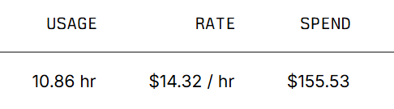
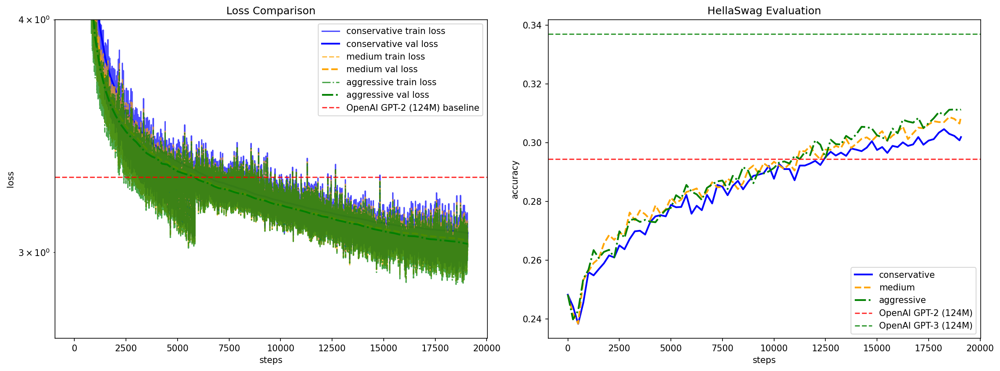

# miloGPT: A GPT-2 Reproduction Study

## Overview

This project reproduces GPT-2 training from scratch, inspired by Andrej Karpathy's [build-nanogpt](https://github.com/karpathy/build-nanogpt) tutorial. Through his comprehensive explanation, I gained deep understanding of GPT architecture, training methodology, and optimization techniques.

The main goal is to understand transformer architectures and training dynamics by implementing a clean, educational version of GPT-2 with modern PyTorch optimizations.

## Experimental Environment

**Hardware:** Lambda Labs `gpu_8x_a100_80gb_sxm4` instance with 8× NVIDIA A100 80GB GPUs  
**Recommendation:** You can adapt this to your hardware setup - for example, using 2× H100 GPUs would be more cost-effective for smaller-scale experiments.

## Quick Start

1. **Download training data** (~10B tokens from FineWeb-Edu):
   ```bash
   python fineweb.py
   ```

2. **Train the model** with custom learning rate:
   ```bash
   torchrun --standalone --nproc_per_node=8 train_gpt2.py --max_lr 6e-4
   ```

3. **Run learning rate ablation study**:
   ```bash
   ./run_ablation.sh
   ```

## Key Optimizations from Karpathy's Implementation

The `train_gpt2.py` includes several performance optimizations:

1. **Flash Attention**: Uses `F.scaled_dot_product_attention()` for memory-efficient attention computation (line 52)
2. **Fused AdamW**: Automatically detects and uses fused optimizer when available on CUDA (line 242-248)
3. **Proper Weight Initialization**: Custom scaled initialization for residual layers using `MILOGPT_SCALE_INIT` (line 120-121)
4. **Weight Sharing**: Token and output embeddings share parameters for efficiency (line 112)
5. **Optimized Weight Decay**: Separates parameters into decay/no-decay groups for proper regularization (line 227-235)
6. **Mixed Precision Ready**: Compatible with torch.compile (though disabled for evaluation compatibility)

## Training Process & Costs

### Initial Cost Challenge
During the first run, I missed the timing and the instance remained idle for 3 hours after completing the first learning rate experiment, leading to unnecessary costs.




**Total cost**: $155.53 for 10.86 hours (@ $14.32/hr)

### Cost Optimization Solution
To prevent idle time, I created `run_ablation.sh` that runs all three learning rates sequentially:
- Conservative (6e-4)  
- Medium (1.2e-3)
- Aggressive (1.8e-3)

**Cost savings**: ~$42-45 by eliminating idle time between experiments.

## Training Results

### Learning Rate Comparison



The results show clear learning rate dynamics:
- **Higher learning rates** (1.8e-3): Faster convergence but more unstable during early training
- **Lower learning rates** (6e-4): More stable but slower convergence
- All approaches eventually reach similar performance levels

### Model Performance

#### Conservative (6e-4)
- **Final validation loss**: 3.0718  
- **HellaSwag accuracy**: 3032/10042 = **30.19%**

#### Medium (1.2e-3)  
- **Final validation loss**: 3.0438
- **HellaSwag accuracy**: 3102/10042 = **30.89%**

*Note: Aggressive (1.8e-3) results were not copied due to terminal context limitations during the experiment.*

### Sample Generations

**Conservative model samples:**
```
Hello, I'm a language model, how does it work? When you talk about a word you use in your daily life, the word is a word from

Hello, I'm a language model, and I want to teach a few classes there. The first thing I have to teach is that, in English, I

Hello, I'm a language model, but in this post I've used two different approaches.
The first one has a method called "inclusive_language
```

**Medium model samples:**
```
Hello, I'm a language model, and I think that I would like to draw a representation of the language around the place and to me it is a part

Hello, I'm a language model, here are the steps I've put into a language model tutorial.
- In programming language model, to put in order

Hello, I'm a language model, do I have different idea of learning about it? That's what I got. I've got a couple of other things
```

### HellaSwag Evaluation

The HellaSwag benchmark evaluates commonsense reasoning capabilities. Both models achieved ~30% accuracy, which is reasonable for a 124M parameter model trained from scratch. The medium learning rate slightly outperformed the conservative approach, showing the benefit of more aggressive training while maintaining stability.

## File Structure

```
├── train_gpt2.py              # Main training script
├── fineweb.py                 # Data download script  
├── hellaswag.py               # Evaluation script
├── run_ablation.sh            # Automated learning rate study
├── results/                   # Training comparison plots
├── results_backup/            # Cost analysis and monitoring
└── log_*/                     # Training logs and model checkpoints
```

## Acknowledgments

Special thanks to [Andrej Karpathy](https://github.com/karpathy/build-nanogpt) for the excellent educational content that made this implementation possible. His detailed explanations of transformer architecture and training best practices were invaluable for understanding modern language model development.

**Original project**: https://github.com/karpathy/build-nanogpt